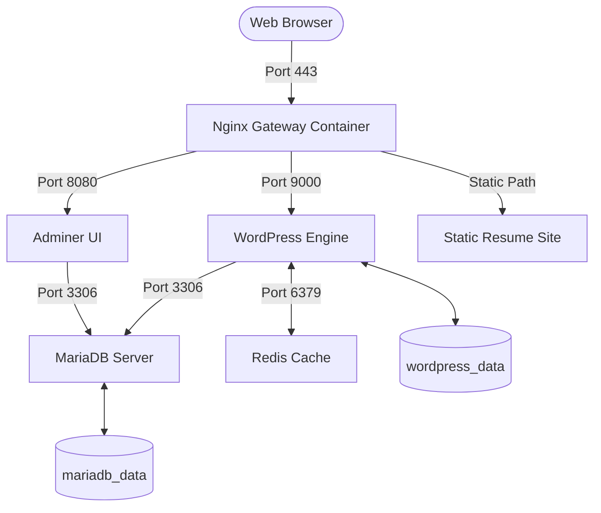
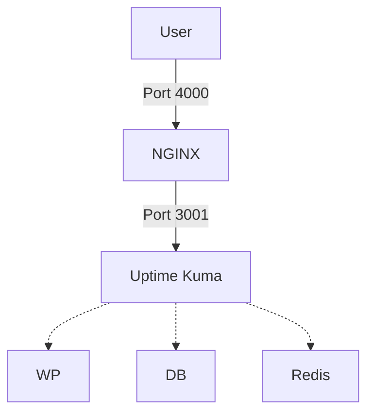

*This project has been created as part of the 42 School curriculum*


# Description

A fully containerized system infrastructure built from scratch using **Docker** and **Docker Compose**.  
Following strict DevOps constraints, all containers are built from scratch utilizing vanilla Alpine Linux base layers. No pre-built DockerHub stack images are used.

## Architecture & Services

The infrastructure consists of the following isolated services interconnected with an isolated bridge network:

### Core Services
* **NGINX Gateway (Port 443)**
    The unified TLS reverse proxy and entry point. Built with **TLSv1.3** protocol to manage secure traffic routing.
* **NGINX Gateway (Port 4000)**
    Used to securely log into Uptime Kuma.
* **WordPress + PHP (Port 9000)**
    Processes dynamic PHP over a network link from direct external web access.
* **MariaDB (Port 3306)**
    The core database store engine for WordPress, with custom entrypoint configuration rules.
* **Adminer (Port 8080)**
    A full-featured database administrator mapped under the `/adminer` path.
* **Redis Cache (Port 6379)**
    A high-performance caching layer integrated into WordPress to keep database execution inside RAM.
* **Static Resume Website**
    A personal static HTML website mapped under `/resume`.
* **Uptime Kuma (Port 4000 / Internal 3001)**
    An automated system auditing dashboard to track container's health status.

## Structural Network Diagram

The following blueprint maps the infrastructure layout, internal communication paths and volume storage links:



The following blueprint maps the infrastructure layout and internal communication paths of Uptime Kuma:



## Persistent Volumes

Data is handled via isolated directory mounts:

* **mariadb_data**: Stores the database files, including indexes, tables, and logs.
* **wordpress_data**: Stores core engine configurations, dynamic themes, and user media uploads.

Data remains available after `make down` unless volumes are explicitly removed.

<br>

# Instructions

## Prerequisites

Before starting the project, make sure that:
1. Docker is installed and running correctly.
2. Docker Compose is available.
3. Map $USER.42.fr to the local loopback address (127.0.0.1). The domain name is mapped in `/etc/hosts`:
  ```plaintext
  127.0.0.1  $USER.42.fr
  ```
4. The required .env and secret files are present.

The .env file is used to store environment variables for domain name, Wordpress, and MariaDB.
This file is located in `/srcs` and must be filled with the following credentials:

```
# DOMAIN
DOMAIN_NAME=${USER}.42.fr

# MARIADB CONFIGURATION
DB_NAME=        #write database name
DB_USER=        #write database username
DB_HOST=        #write database hostname

# WORDPRESS SETUP
WP_URL=https://${DOMAIN_NAME}
WP_TITLE=" "    #write wp title
WP_SUBS_USER=   #write wp subscription username
WP_ADMIN_USER=  #write wp admin name
```

Using Docker Secrets all sensitive system credentials are securely extracted at execution runtime, from the `secrets/` directory
Write your passwords into these text files:

* `secrets/wp_admin_password.txt` — Dedicated admin pass for WorPress.
* `secrets/wp_subs_password.txt` — Dedicated subscription pass for WorPress.
* `secrets/db_password.txt` — Dedicated user pass for MariaDB.
* `secrets/db_root_password.txt` — Dedicated root pass for MariaDB.
* `secrets/kuma_password.txt` - Dedicated user pass for Uptime Kuma admin instances.


5. Compile, build, and run with Makefile:

```bash
make       # Triggers image assembly and detaches background runtime environments
```

## Useful Control Commands

```bash
make down    # Safely stops active containers without removing volume state assets
make clean   # Purges container runtimes, network segments, and internal caches
make fclean  # Absolute reset: Destroys ALL persistent directory assets and volumes
make ps      # Verify the state of the containers
make logs    # Inspect the logs
```

## Exposure Layouts

Since the architecture executes inside an isolated local network, services can be safely reached via this map routes (replace USERNAME with the actual username):

* **Main WordPress Application**: https://USERNAME.42.fr
* **WordPress Admin Login**: https://USERNAME.42.fr/wp-admin
* **Adminer Database Gateway**: https://USERNAME.42.fr/adminer
* **Static Portfolio Resume Site**: https://USERNAME.42.fr/resume
* **Uptime Kuma Health Dashboard**: https://USERNAME.42.fr:4000

    ⚠️ Note on SSL Certificates: Because the underlying TLS configuration relies on custom self-signed system certificates, web browsers will show a local safety bypass prompt. Simply click "Advanced" ➔ "Proceed to USERNAME.42.fr (unsafe)" to connect.


## Test the system

Because the project uses a local self-signed certificate, the browser may display a warning. This is normal for local development.

### Wordpress

Main WordPress site: https://USERNAME.42.fr

Log into Wordpress as admin: https://USERNAME.42.fr/wp-admin

Username: $WP_ADMIN_USER  
Password: `wp_admin_password.txt`

Log into Wordpress as subscriber: https://USERNAME.42.fr/wp-login.php

Username: $WP_SUBS_USER  
Password: `wp_subs_password.txt`

### MariaDB

Log into the database via CLI:
```bash
make exec_mariadb

/usr/bin/mariadb -u root -p$db_root_password $DB_NAME -e "SHOW TABLES;"
/usr/bin/mariadb -u root -p$$db_root_password $DB_NAME -e "SELECT COUNT(*) FROM wp_posts;"
```

### Adminer

Log into MariaDB via the Adminer interface: https://USERNAME.42.fr/adminer
```
system: mysql/maria  
server: $DB_HOST  
user: $DB_USER  
pass: `db_password.txt`  
database: $DB_NAME  
```

### Redis

Monitor the activity of Redis:

```bash
docker exec -it redis redis-cli monitor
```

### HTML Static Site

The static website is reachable here: https://USERNAME.42.fr/resume

### Uptime Kuma

Log into Uptime Kuma: https://USERNAME.42.fr:4000

username: admin  
password: `kuma_password.txt`

Set the following monitoring:

| Kuma monitors | Type | Ping | TCP Port |
|---------------|------|------|----------|
| WordPress | TCP Port | wordpress | 9000 |
| MariaDB | TCP Port | mariadb | 3306 |
| Redis Cache |	TCP Port | redis | 6379 |
| Adminer | HTTP(s) | http://adminer:8080 | None |

To check if Kuma works correctly, start and stop containers with:
```bash
docker stop <container name>
docker start <container name>
```


## Check ports

Check that port 443 (https) is reachable, and that the connection on port 80 (http) is refused:
```bash
curl -Iv https://USERNAME.42.fr
curl -Iv http://USERNAME.42.fr
```

Check the handshake protocol:
```bash
openssl s_client -connect USERNAME.42.fr:443 -tls1_3
openssl s_client -connect USERNAME.42.fr:443 -tls1_2
```

Check that MariaDB or WordPress cannot be reached directly through the loopback, to prove the ports are safely locked inside the Docker container network and are not leaking out to the public host:
```bash
curl -v http://localhost:3306
curl -v http://localhost:9000
```

Connect to WordPress from the Nginx Container:
```bash
make exec_nginx

apk add curl
curl -v wordpress:9000
```
