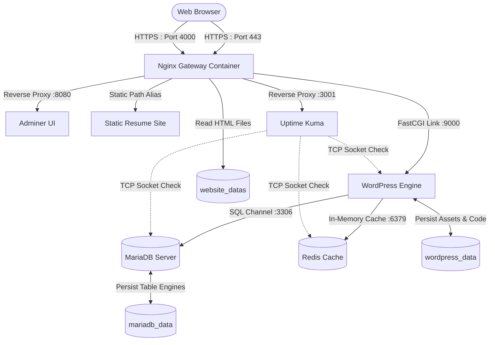

# Inception


*This project is part of the 42 school curriculum system administration branch.*

A fully containerized system infrastructure built from scratch using **Docker** and **Docker Compose**. Following strict DevOps constraints, all containers are built from scratch utilizing vanilla alpine linux base layers—**no pre-built DockerHub stack images are used**.


## Architecture & Services

The infrastructure consists of the following isolated services interconnected within a isolated custom bridge network:

### Core Services
* **NGINX Gateway (Port 443 & Port 4000)**
    The unified TLS reverse proxy and sole entry point. Built with explicit **TLSv1.2** and **TLSv1.3** protocols to manage secure traffic routing.
* **WordPress + PHP-FPM (Port 9000)**
    Processes dynamic PHP lifecycle execution natively over a isolated network link, isolated from direct external web access.
* **MariaDB (Port 3306)**
    The core relational database store engine for WordPress, fully hardened with custom entrypoint configuration rules.

### Bonus Extensions
* **Adminer (Port 8080)**
    A single-file, full-featured database management framework mapped cleanly under the secure `/adminer` path proxy layer.
* **Redis Cache (Port 6379)**
    An in-memory high-performance caching layer explicitly integrated into WordPress to keep database execution payloads inside container RAM.
* **Static Resume Website**
    A personal static HTML workspace directory mapped natively through Nginx static locations via `/resume`.
* **Uptime Kuma (Port 4000 / Internal 3001)**
    An automated synthetic system auditing dashboard utilizing native automated shell provisioning to dynamically track container layer health status metrics.


## Structural Network Diagram

The following blueprint maps the infrastructure layout, internal communication paths, volume storage links, and active synthetic auditing flows:




## Persistent Volumes

Data integrity is handled via isolated host-side directory bind mounts ensuring configuration parameters survive cluster cycle commands:

* **mariadb_data**: Stores system schemas and table indexes.
* **wordpress_data**: Stores core engine configurations, dynamic themes, and user media uploads.
* **website_datas**: Host repository layer holding standard static portfolio source code assets.


## Installation & Quick Start
Prerequisites

Ensure your target platform has native Docker engines running smoothly.
1. Clone the Workspace

```bash
git clone [https://github.com/your-username/inception.git](https://github.com/your-username/inception.git)
cd inception
```

2. Configure Local Infrastructure Secrets

All sensitive system credentials are securely extracted at execution runtime using Docker Secrets. Create a local untracked secrets/ directory layout at the system root folder:

```bash
mkdir -p secrets
```

Populate your local password tracking configurations into these uncommitted files:

* secrets/credentials.txt — Plaintext credentials allocated for the WordPress main user.
* secrets/db_password.txt — Dedicated security user pass for MariaDB connectivity.
* secrets/db_root_password.txt — System master operational control key for MariaDB admin instances.
* secrets/kuma_password - Dedicated security pass for Uptime Kuma admin instances.

3. Initialize Domain Redirection

Per project requirements, append an explicit translation pointer mapping your standard loopback route configuration to the system hostname inside /etc/hosts:
```plaintext
127.0.0.1  aielo.42.fr
```

4. Build and Fire the Infrastructure Stack

Compile, build, and run the cluster through the orchestrating Makefile wrapper:

```bash
make       # Triggers image assembly and detaches background runtime environments
```

### Exposure Access Target Layouts

Since the architecture executes inside an isolated local network, services can be safely queried via your loopback endpoint map routes:

* **Main WordPress Application**: https://aielo.42.fr
* **Adminer Database Gateway**: https://aielo.42.fr/adminer
* **Static Portfolio Resume Site**: https://aielo.42.fr/resume
* **Uptime Kuma Health Dashboard**: https://aielo.42.fr:4000

    ⚠️ Note on SSL Certificates: Because the underlying TLS configuration relies on custom self-signed system certificates (nginx.crt), modern web browsers will show a local safety bypass prompt. Simply click "Advanced" ➔ "Proceed to aielo.42.fr (unsafe)" to connect.

### Useful Management Control Commands

```bash
make down    # Safely stops active containers without removing volume state assets
make clean   # Purges container runtimes, network segments, and internal caches
make fclean  # Absolute reset: Destroys ALL persistent directory assets and volumes
```


## References & Resources

- [Official Docker Architecture Docs](https://docs.docker.com/)
- [Docker Compose Specification Guides](https://docs.docker.com/compose/)
- [Nginx Reverse Proxy Configurations](https://nginx.org/en/docs/)
- [University of Helsinki: DevOps with Docker Curriculum](https://courses.mooc.fi/org/uh-cs/courses/devops-with-docker)
    